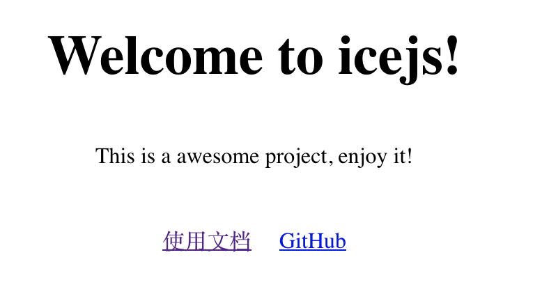

# 学习ice.js

[TOC]

## 1、关于ice.js

ice.js的中文名是飞冰，是一个基于 React 的研发解决方案，围绕研发框架 icejs 提供完善的领域解决方案，同时结合可视化操作、物料复用等方案降低研发门槛[^1]。


## 2、第一个ice.js应用

按照官方指南[^2]，有两种创建ice.js应用方式

* CLI方式。使用npm命令或者yarn命令
* GUI方式。使用VS Code的AppWorks插件。

这里主要介绍使用CLI方式。


### (1) 初始化一个ice.js应用

使用下面命令，初始化一个ice.js应用

```shell
$ mkdir hello_icejs
$ cd hello_icejs
$ npm init ice
create-ice version: 1.7.5
create-ice args . undefined
? Please select a template (Use arrow keys)
❯ TypeScript + No UI Components 
  TypeScript + Ant Design 
  TypeScript + Fusion Design 
  TypeScript + Fusion Design Pro  
  JavaScript + Fusion Design 
  ice.js plugin development template. 
```

为了简单起见，选择“TypeScript + No UI Components ”，回车执行，输出如下

```shell
$ npm init ice
create-ice version: 1.7.5
create-ice args . undefined
? Please select a template TypeScript + No UI Components
download tarballURL https://registry.npmmirror.com/@alifd/scaffold-simple/download/@alifd/scaffold-simple-1.1.1.tgz
✔ download npm tarball successfully.
clean package.json...

Initialize project successfully.

Starts the development server.

    cd .
    npm install
    npm start


We have prepared develop toolkit for you. 
See: https://marketplace.visualstudio.com/items?itemName=iceworks-team.iceworks
```

然后继续执行下面命令

```shell
$ npm install
$ npm start
```

命令行终端自动打开http://localhost:3333/网页，显示如下



由于选择“No UI Components”，因此网页比较简陋。


到这里，总结归纳一下，使用CLI方式，主要有三个步骤

* 初始化工程
* 安装依赖
* 启动工程


ice.js应用也是npm工程结构的，实际上`npm init ice`命令已经预置一份内容到package.json，如下

```json
{
  "name": "@alifd/scaffold-simple",
  "version": "0.1.0",
  "description": "使用 TypeScript，未使用任何 UI 库。",
  "dependencies": {
    "react": "^17.0.2",
    "react-dom": "^17.0.2"
  },
  "devDependencies": {
    "@iceworks/spec": "^1.0.0",
    "@types/react": "^17.0.2",
    "@types/react-dom": "^17.0.2",
    "eslint": "^7.30.0",
    "ice.js": "^2.0.0",
    "stylelint": "^13.7.2"
  },
  "scripts": {
    "start": "icejs start",
    "build": "icejs build",
    "lint": "npm run eslint && npm run stylelint",
    "eslint": "eslint --cache --ext .js,.jsx,.ts,.tsx ./",
    "eslint:fix": "npm run eslint -- --fix",
    "stylelint": "stylelint \"**/*.{css,scss,less}\""
  },
  "repository": {
    "type": "git",
    "url": "https://github.com/ice-lab/react-materials/tree/master/scaffolds/simple"
  },
  "private": true,
  "originTemplate": "@alifd/scaffold-simple"
}
```


可以选择一个“TypeScript + Fusion Design ”模板创建，package.json，如下

```json
{
  "name": "@alifd/scaffold-lite",
  "version": "0.1.0",
  "description": "轻量级模板，使用 TypeScript，仅包含基础的 Layout。",
  "dependencies": {
    "@alifd/next": "^1.19.4",
    "moment": "^2.24.0",
    "react": "^17.0.2",
    "react-dom": "^17.0.2",
    "@alifd/theme-design-pro": "0.x"
  },
  "devDependencies": {
    "@iceworks/spec": "^1.0.0",
    "build-plugin-moment-locales": "^0.1.0",
    "eslint": "^7.30.0",
    "ice.js": "^2.0.0",
    "stylelint": "^13.2.0",
    "build-plugin-ignore-style": "^0.1.0",
    "@types/react": "^17.0.2",
    "@types/react-dom": "^17.0.2"
  },
  "scripts": {
    "start": "icejs start",
    "build": "icejs build",
    "lint": "npm run eslint && npm run stylelint",
    "eslint": "eslint --cache --ext .js,.jsx,.ts,.tsx ./",
    "eslint:fix": "npm run eslint -- --fix",
    "stylelint": "stylelint \"**/*.{css,scss,less}\""
  },
  "repository": {
    "type": "git",
    "url": "https://github.com/alibaba-fusion/materials/tree/master/scaffolds/scaffold-lite"
  },
  "private": true,
  "originTemplate": "@alifd/scaffold-lite"
}
```

可以看出多了一些npm库的依赖。


## References

[^1]:https://ice.work/docs/guide/about
[^2]:https://ice.work/docs/guide/start